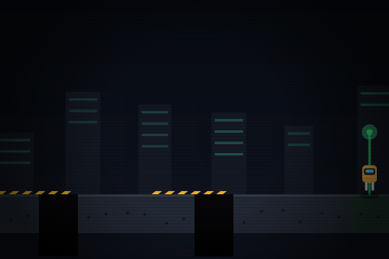

# Null Island

A browser-based coding-puzzle platformer. You crash-land on an island of
buried, half-broken technology — the only way out is to learn to program its
systems against it. Real JavaScript, real p5.js, no build step.

See [DESIGN.md](DESIGN.md) for the full design doc (premise, world-by-world
breakdown, mechanics, stack).

## Running it

No install, no build. Open [`index.html`](index.html) in a browser, or serve
the folder with any static server, e.g.:

```
npx serve .
```

## World 1 — The Wreck

The first playable slice: [`levels/world1/`](levels/world1/). Teaches
sequential commands (`moveRight()`, `jump()`).

<p>
  
  
</p>
