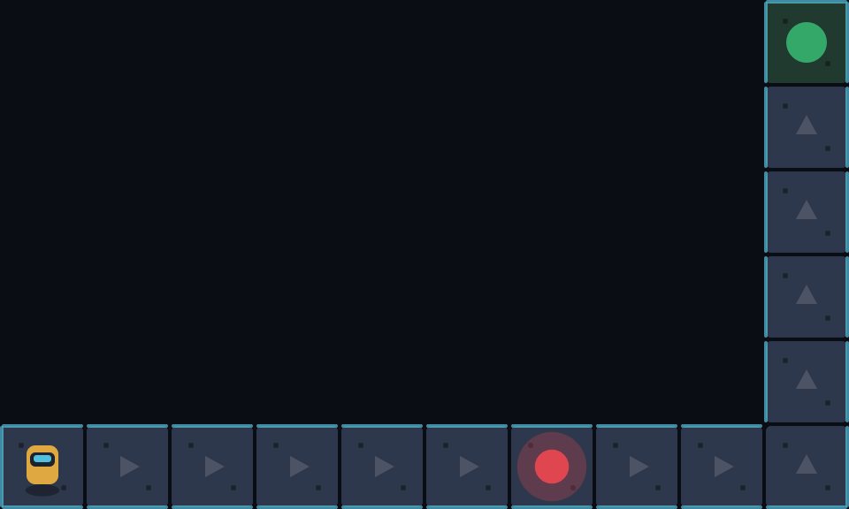

# Null Island

A browser-based coding-puzzle platformer. You crash-land on an island of
buried, half-broken technology — the only way out is to learn to program its
systems against it. Real JavaScript, real p5.js, no build step.

See [DESIGN.md](DESIGN.md) for the full design doc (premise, area-by-area
breakdown, mechanics, stack).

## Running it

No install, no build. Open [`index.html`](index.html) in a browser, or serve
the folder with any static server, e.g.:

```
npx serve .
```

`index.html` is a splash screen that leads into `worlds.html`, the area
select / settings screen — it shows every area's lock state, best move
count, par, and a star for an optimal clear, plus a "reset progress" option.
Progress is saved locally in the browser (no accounts).

## Area 1 — The Wreck

[`levels/world1/`](levels/world1/). Teaches sequential commands
(`moveRight()`, `jump()`).

<p>
  
  
</p>

## Area 2 — The Vents

[`levels/world2/`](levels/world2/). Teaches loops. An L-shaped vent shaft
patrolled by a Scanner — the obvious "just loop straight there" solution
walks right into it, so clearing the level means noticing that *when* your
loop runs matters, not just that it exists.

<p>
  
</p>

## Command palette

Every level lists its available commands next to the editor. A command
starts as plain text; the first time you actually type it yourself, it
turns into a button you can click to insert it again — so repetition is
free once you've proven you know the syntax, but nothing is handed to you
before that.
